# Capallin: Unleashing Capital, All In

Explore the world of finance with Capallin, your comprehensive solution for:

- <b>Stock Screener 🔍:</b> Effortlessly filter stocks based on your criteria in both the Malaysian and US markets, uncovering diverse investment opportunities.

- <b>Latest Market News 🌐:</b> Stay ahead with up-to-the-minute market news, ensuring you're informed on global financial developments impacting both Malaysia and the US.

- <b>Portfolio Management 📊:</b> Seamlessly manage your investments, track performance, and optimize your portfolio for success across borders.

- <b>Financial Reports and Data 📰:</b> Access in-depth financial reports and data from both the Malaysian and US markets to make well-informed investment decisions.

- <b>Real-Time Charting 📈:</b> Visualize market trends and stock performance with dynamic, real-time charts, providing insights into market movements.

Capallin brings together these powerful features, offering a holistic financial experience tailored to investors in both Malaysian and US markets, seeking efficiency, accuracy, and timely insights. Empower your global financial journey with Capallin – your all-in-one financial companion.

## Screenshots

**Video Overview**

https://github.com/dev6699/capallin-docs/assets/64014731/2d1e26fe-c035-45f7-a38b-1162d94a9e40

 

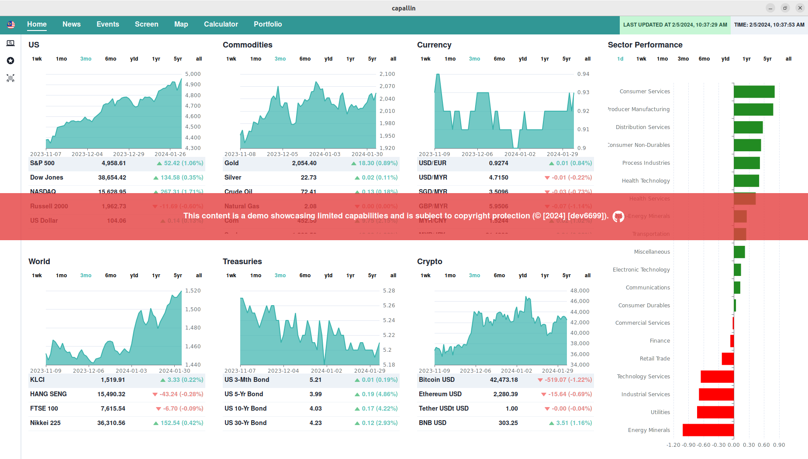
*Home*

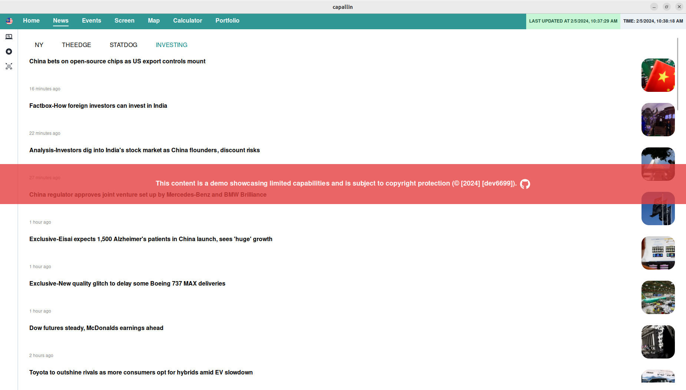
*News*

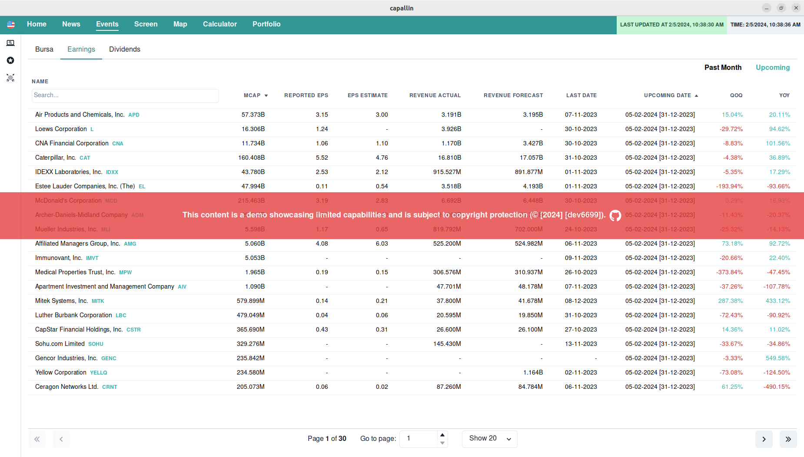
*Events*

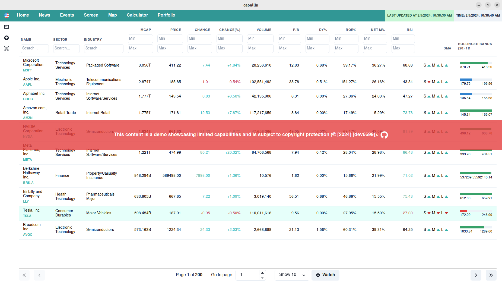
*Screen*

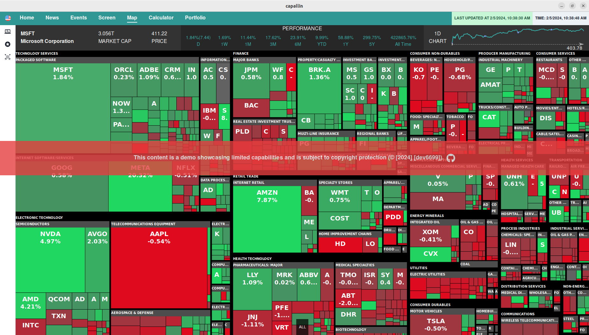
*Map*

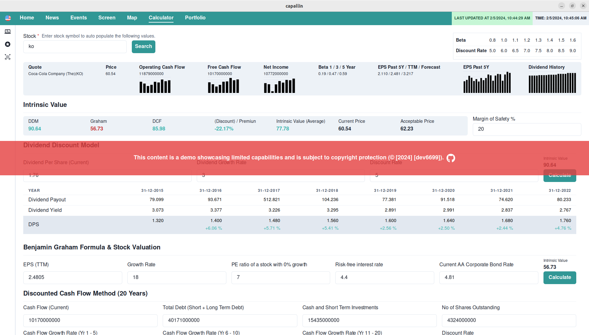
*Calculator*

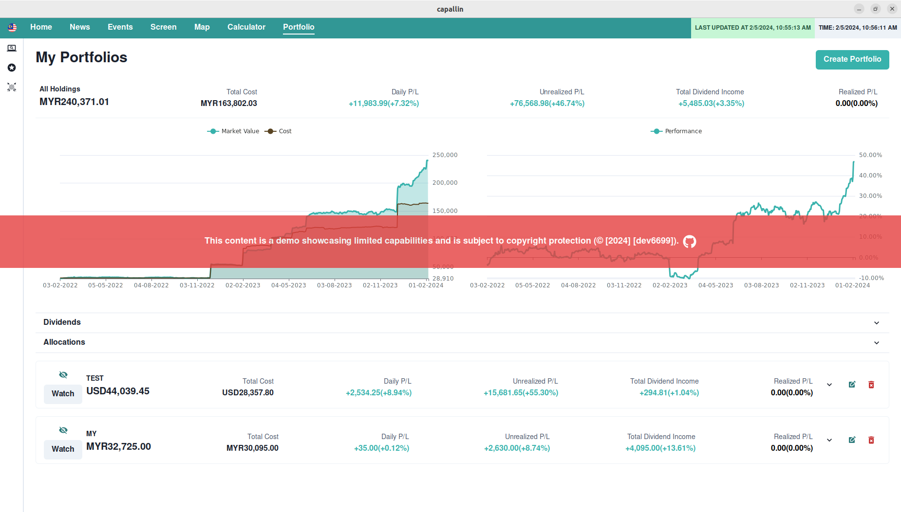
*Portfolio 1*

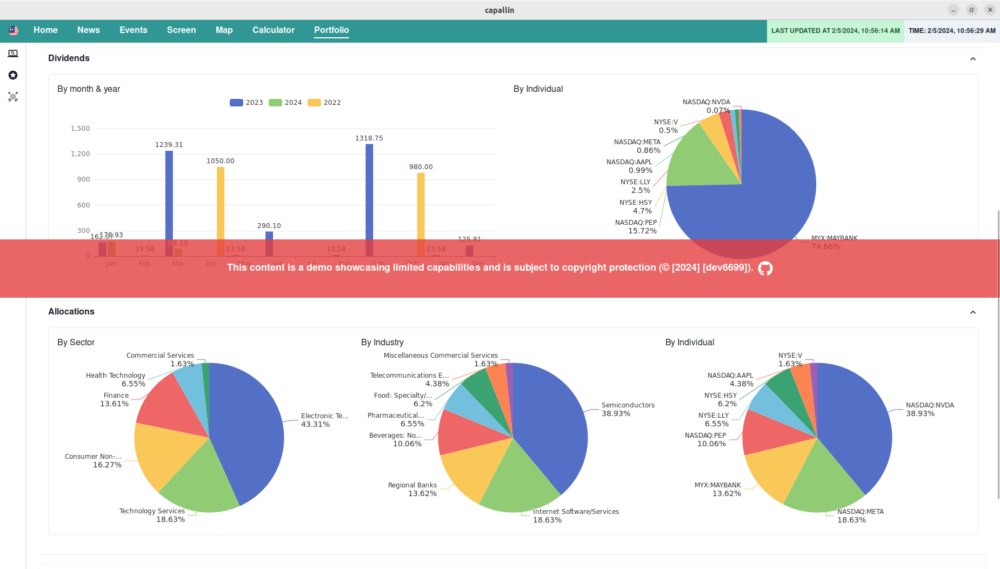
*Portfolio 2*

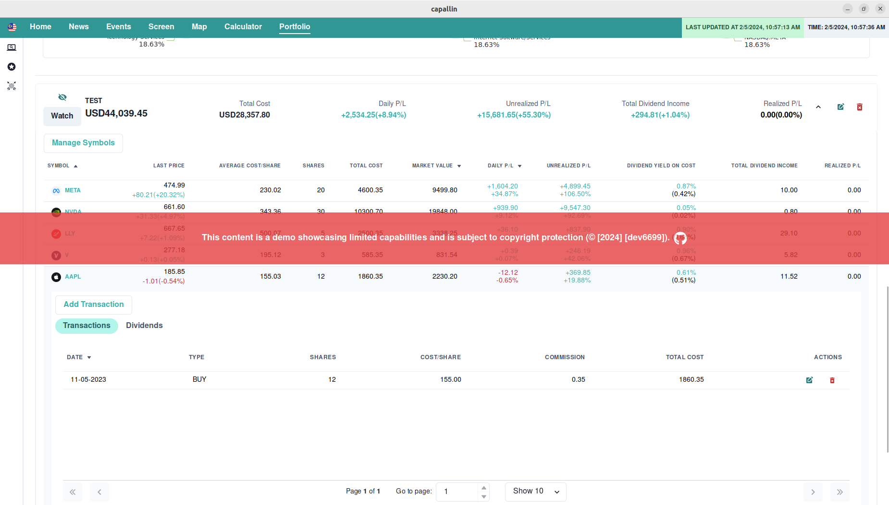
*Portfolio 3*

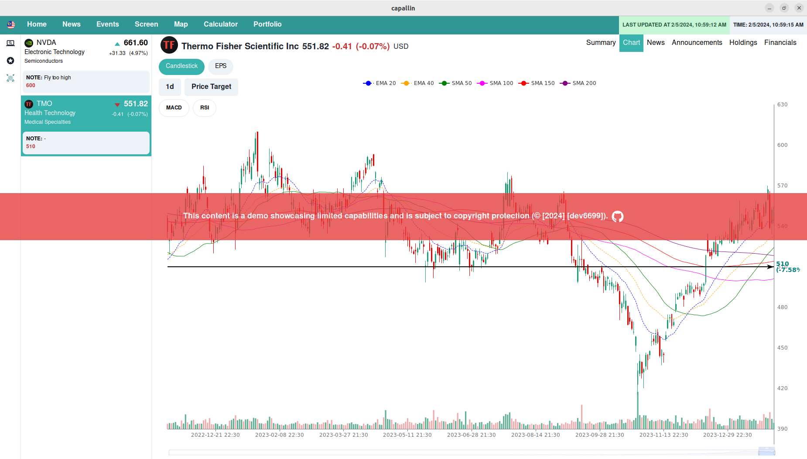
*Chart*

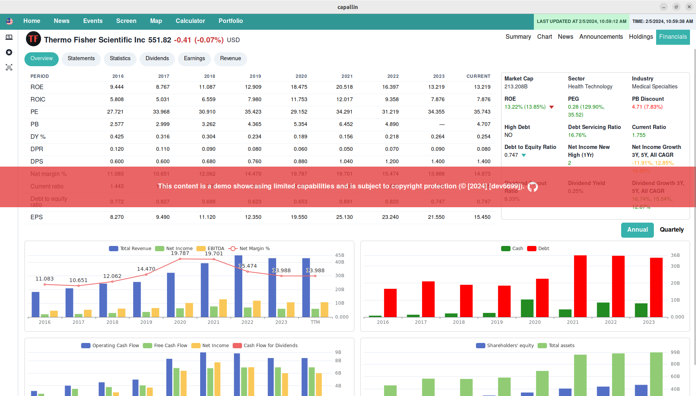
*Financials*
